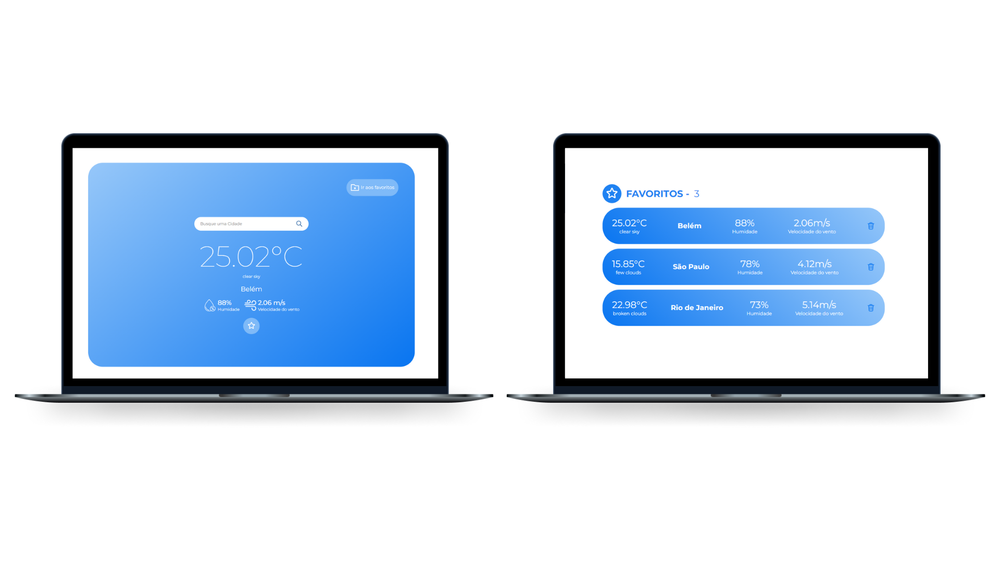

<h1 align="center">
   Teste Front-end BitX
</h1

<br>

<p align="center">
  <a href="https://github.com/marlonandrei777/teste-front-end/blob/main/LICENSE.md"></a>
</p>



## 💻 Projeto

O projeto é uma aplicação Web onde podemos obter informações sobre o clima de várias cidades, seja pela localização atual indicada pelo navegador ou filtrando pela barra de pesquisa.<br>
<br>
Possuindo campo de busca por cidade, e uma pagina de favoritos.
## 📑 Briefing do teste

✅ Carregar a sua localização<br>
✅ Possibilitar buscar a localização desejada<br>
✅ Mostrar informações de clima como temperatura, umidade, vento, previsão de chuvas<br>
✅ Deve também mostrar os alertas, caso existam no retorno da API<br>
✅ Deve ser possível adicionar/remover locais aos favoritos para acesso rápido<br>
✅ Verificar o conteúdo carregado da API. de 15 em 15 segundo pra fazer uma nova chamada e atualizar o estado de tela com os dados recebidos<br>
## 🔥 Tecnologias

- Angular v18
- TypeScript
- Sass

## ➕	Adicionais
- Cidades favoritas armazenadas no localStorage
- Testes unitários
- Responsividade
- Padrão de Commits
- Readme
- Versionamento de código utilizando Git

## 🛠 Instalação

#### Pré-requisitos
Antes de começar a rodar o projeto, você precisa ter instalado em sua máquina as seguintes ferramentas: 
[Git](https://git-scm.com/), [NodeJs](https://nodejs.org/en/).<br>
Além disso, para facilitar a visualização do código você vai precisar de um editor: [VSCode](https://code.visualstudio.com/).

## ⚙ Rodando a aplicação

```bash
#realize o clone do repositório
$ git clone https://github.com/marlonandrei777/teste-front-end.git
```
```bash
#acesse a pasta do projeto
$ cd teste-front-end
```
```bash 
#instale as dependências (com npm)
$ npm i
```
```bash 
#execute o projeto
$ ng start
```
```bash 
#Rode os testes
$ ng test
```
_A aplicação estará em execução em: localhost:4200_
